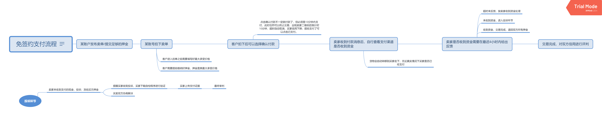
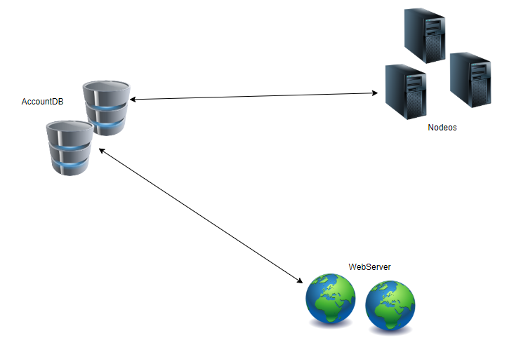

## 交易行的设计（法币）
----
**难点**
* 在不接支付宝等第三方平台API的情况下，如何处理作弊问题？
* 如何保证交易的可信性

**解决方案探讨**
1. 第一个方案
   9

1. 让承兑商提供第三方兑换功能，系统分支进行监控….

## 开发计划

主网站 = {数据库管理网站、历史币价采集网站、 网页提供网站（用户接口）、区块链交互端网站}

## union官网与区块链的交互

在EOS系统中，最主要的是Nodeos，Cleos 与 Keosd都是辅助功能。在Union系统中，AccountDB其实相当于同时充当了Cleos与Keosd的功能。AccountDB、Nodeos、Webserver的关系如下图所示： 

AccountDB储存了大量用户的私钥信息，所以私钥不适合进行网络传输，而应该直接在本地进行签名。所以，交易的流程大概是这样的： 用户登录WebServer，填写交易信息，交易推送到AccountDB进行签名，此时如果用户的登录信息正确，则找到正确的私钥进行签名。AccountDB再调用Nodeos的RPC Api接口，将数据写入到区块链上。

目前暂时只提供这一条线吧，考虑再三，还是要把WebServer的代码用javascript，为了方便以后的扩展。因为理论上，用户也可以直接保存自己的私钥信息，而不是借助AccountDB。也就是说应该有一条线是WebServer直接与Nodeos交互的，但这是以后再扩展的工作了。

### Account DataBase 

数据库服务部分是由多台主机构成，当然不会比webserver的主机多。每台主机都运行数据库服务，同时也有一个wrap，实现connector功能，还实现与webserver的交互。这个数据库主要保存了账号的私钥部分，当然保存方式是把私钥截断，并与很多无效数据进行混淆。只有webserver提供了可靠的信息，才能从浩如烟海的数据堆中拼凑出正确的私钥。因此，对Account Database的攻击是无效的。

AccountDB集成了Nodeos的RPC Api，也就是在AccountDB里直接会进行交易签名，然后对Nodeos进行远程调用，目前采用的是nodejs，也就是采用官方的SDK， eosjs。

### WebServer
首先要界定官网的职责与作用。官网必须要以一些核心的功能，也是最常用的功能，从而吸引大量的用户浏览。从而向世界传递出Union的思想、文化。
1. Union账户间转账功能。  其它类型的交易主要由交易行提供。  
2. 发布、接收、提交奖励任务功能
3. 可用服务展示、搜索；以及成为服务提供者入口
4. 信息展示功能

#### 转账功能
用户登录到webserver后，要想使用钱包转账等功能，会被要求提供另一个账号和密码，该密码是在Account DataBase中找到正确信息的关键。一般的，webserver的常规数据库根据用户账号密码会保存一部分的Account Database中的私钥获取线索。另一部分需要用户输入。

例如，用户输入信息串 S + var  得到的结果hash得到了Account Database中的数据地址，当用户变更S时，可以任意的改变var而得到一个从没被使用过的新位置存放私钥。这就避免了直接用S表示私钥位置的尴尬，因为用户变更S到新值时很可能那个位置已经被别人占用了。当然，私钥很可能是被截断保存的，采用类似的方法可以做到，这里不再具体赘述。

从安全的角度，网络传输可以使用非对称加密，从而保证网络传输过程中的信息安全。只有在上述网络的节点本机上，密钥才可能会被从内存截获。但在保证相关各个环节主机可靠性的基础上，信息的安全性是得到保证的。即使某个节点被完全攻破，数据外泄，也不会产生财务安全问题，除非那些节点在网络上实时的运行时遭受‘监控’才会产生安全问题，但也只是局部的安全问题。

#### 发布、接收、提交奖励任务

#### 可用服务的展示、搜索；以及成为服务提供者入口
可提供的服务展示、搜索主要是与connector的交互，connector之前的开发较为简单，看来是有必要搞数据库的。然后提供一些接口。  

服务的提供者入口预示着每个服务都有自己的成为服务者页面。这包括小时单价、各种需求等。这里最好就是这些都由服务本身计算提供，connector只是维护他们的ip。

#### 信息展示
大事件、文化、信仰。这部分主要是宣扬一些理念的，参考宗教传教。主要是让人们有信仰，树立价值观。

#### 数据库的设计
为适应可能到来的大量数据的情况，提前设定好可自动增表表设计。
>人员信息表
>>id 自增  
>>nickname  
>>email  
>>sex gender  
>>password  
>>  
>>实现自动分表的方式。首先，id是从0开始的自增的数字；可以设定一个具体的最大表容量，比如一个表最多有100w条记录。之后就另外分表，分表会按着原先的id自增下去。  
>>用户的登录是以id和password登录的，可以根据id很快的判断它所在的表。所以没法实现更人性化的email登录。

>钱包信息表
>>id  
>>EOS public key   
>>salt  hash(密码 + salt + id) 得到私钥的位置，如果没有salt，当用户改密码时，可能会引起储存位置冲突   
>>信用度  
>>余额  不代表区块链上的确切余额  
>>chainId  区块链ID，适用于多链的情况  
>>钱包状态  
>>正在挂单的数量

>账号转账关系表  （曾经转出过的id列表，采用定长字符串，_分隔）
>>id  
>>string

以上3个表都是按id进行水平分表的。

#### 以下是交易行的表
>当前交易信息（挂单）表
>>pending id 基本保证其唯一性  
>>id 挂单者id
>>单价上限  
>>单价下限  
>>兑换物  
>>抵押的Union coin数量  
>>出货量  

>交易冲突表
>>

上面这个表是按记录数量进行分表的。 以上所有的表都会在25%左右的节点更新（同时不小于4台）；用户在表的创建时，会随机选择25%的同类主机进行分配。但是用户的注册id还是会发给所有节点（同类服务器）。  
复杂的是，当某个节点上的数据完全丢失时，或者新加入的节点怎么去弥补缺损的数据。可行的办法是，经常性的做节点25%检查。当低于25%时，将对该条数据进行节点备份增加。毕竟检查某个账户是否存在某个节点的数据库里不是一件很耗费资源的事。当然，有2~4个左右的节点保存这全部的数据。这些节点不属于这个网站服务器的一部分，只是作为数据存储功能。也就是说，每类服务都由这些部分组成：
 1. 主服务部分，这些节点的数据库都是不全的
 2. 全数据节点，几乎不参与服务的业务逻辑范畴，数据只作为备份使用

>交易历史（已经成交或者失效的挂单）
>>transaction id 基本保证其唯一性  
>>id 挂单者id
>>单价上限  
>>单价下限  
>>兑换物  
>>抵押的Union coin数量  
>>出货量

上面的这个表主要存在全数据节点，按时间周期进行分表，只存2年的数据。

### 数据交互安全————一个未知的通信系统设计
这里描述的是一个构建安全加密通信方法，这个方法主要通过经常自发更换密钥实现。首先，双方随意选定初始的密钥对进行通信————这里说的都是非对称加密。要变更密钥时，客户端服务器C1、C2、C3在某个约定的时刻同时产生它们的密钥对，在多对中随机选一对。此时3个客户端服务器，系统内总共就产生了3对。此时每个客户端服务都选取此时正好与nodeos端交互的账户的公钥对密钥对进行加密传输到某个特定的服务端（AccountDB）设为S1。S1随机选取一个密钥对进行解密，拿到其中的公私钥，再把公钥在网络中公布用于接下来的秘密通信。S1再用之前的那个用户的公钥加密私钥发送给其它服务端S。如此循环下去，通信所用的公、私钥将难以被确定。

可能的破解办法是，更换密钥的过程中，正好某个用户在交互，他也正好发现自己的私钥能破解公私钥加密信息。防止的办法是多层加密。

第一阶段，通信是以一个随机的密码k1进行

第一次密钥更换，通信仍然用随机密码，但公私钥信息被选取的公钥进行再次加密，也就是被双重加密

第二阶段，密钥更换完毕，用新生成的公钥k2加密信息   

第二次密钥更换，通信k2，但公私钥信息被随机选取的公钥进行再次加密，也就是被双重加密  
：  
：  
：  

#### 安全问题随想
**案例1**  
假设一个用户用ip访问直接接入网络，当然这是不安全的做法。他怎么保证接入的连接的网站就是官网呢？

> 解决办法  
> 给出不安全提示，涉及到安全相关操作时要求下载app或者插件。

**案例2**  
假设我们有App，或者至少有浏览器插件。每个插件都有服务器端的公钥证书，用来验证服务器的真实性。但假如网络上有一些恶意网站，提供被篡改过的App或者浏览器插件下载。这些App或插件什么都和正宗的一样，除了不会真正的加密客户的真实密码，从而导致密码被中途劫持。那么，如何避免这样的情况发生?

1. 计算安装文件的md5等值  
2. 尽量在可靠的官网发布app

**案例3**  
普通用户如何识别官网的真假呢？假如一个人获得的App，自己也无法保证是否是正确的；其次，它也不知道官网在哪；所以无从查看MD5进行比对。那么，它如何确定自己的App就是正式的App，自己访问的就正宗的官网呢？假如所有明面上的官方渠道都被封锁的情况下。某个人本来拥有Union账户，后来他和Union失联了，他怎么安全的回到Union呢？新用户的情况又是怎样的？

1. 正确的App访问的肯定是正确的官网
2. 对于老用户，要想在无法知晓是否是假官网的情况下，想安全的找回原来的账户，他必须至少知道服务器的正确公钥，可以用公钥加密向服务器发送加密消息，进一步获得正确官网的地址。 
3. 对于新用户，那得自己判断获取渠道是否可靠了。
4. 当然如果能有明面上的官网，这些都不是问题！
5. 所以，新用户的时候，他们一般都拿到了正确的APP，只要有正确的APP就不会有问题。正确的App会用正确的公钥与服务器通信，只要正宗的服务器才能解。